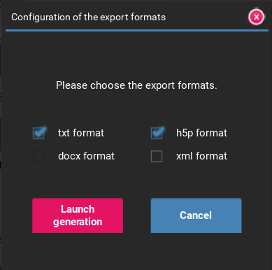

---
export_on_save:
    puppeteer: ["pdf"] # export PDF file on save
---
# MCQMaker

*Version 4.0.1*

## Installation

To install the program on your computer, two options are possible:
- If you are using *Windows*, you can download the executable version in the form of a *zip* file at [the following address](#TODO). Once the download is complete, unzip the file to the desired location.
- If you are using another OS or want to modify your version of MCQMaker, you can clone the git repository using the following command in a terminal once in the folder of your choice.

```bash
git clone git@gitlab.com:PaulCreusy/qcmmaker.git
```

### Creation of a virtual environnement

If you choose to clone this repository, you might want to use a virtual environnement.

You can create one with the following command :

```bash
python -m virtualenv mcqmaker_venv
```

To start it, use the command on Windows : 

```bash
mcqmaker_venv\Scripts\Activate.ps1
```

Or for MacOS and Linux :

```bash
mcqmaker_venv\Scripts\activate
```

### Installation of the necessary packages

To use this software, you need several Python libraries specified in the `requirements.txt` file.

To install them, use the command :

```
pip install -r requirements.txt
```

## Usage

If you have downloaded the executable version, simply double-click on the file `MCQMaker.exe`.

If you have cloned the git repository, the program launches with the following command in the program folder:
```bash
python MCQMaker.py
```

*MCQMaker* is composed of four main menus whose functions are explained below:
- A general menu launching at the start of the application
- A menu for generating MCQs
- A menu for creating and editing databases
- A menu for modifying classes


### Menu for generating MCQs

This menu allows you to generate MCQs in several different formats, `txt`, `docx`, `h5p`, and `xml`, from configurations created in this menu.


#### Creating a configuration

To create a configuration, you must select a file from the database using the menu in the top right corner. Once you have selected the desired folder and file, you can enter the number of questions from this file that you want in the MCQ. The number of available questions in the file is indicated to the right of the text area. Then, you must add the database by clicking on the `+` button. This new file will be displayed in the drop-down list just below, and you will be able to modify the number of questions of the already chosen files later.

!!! tip Number of questions
    The total number of questions contained in the configuration is displayed on the left-hand menu.

Before saving it, you must specify its name in the corresponding text area. After saving it, you will be able to load it later using the `Load a configuration` button.

!!! info Selecting a class
    If you choose to use a class, it is possible that the total number of questions available in some files, which would have already been used by this class in a previous MCQ generation, is different from the value contained in the configuration. In case of exceeding the number of available questions, the number of selected questions will be automatically adjusted to the maximum.

#### Generating an MCQ

The MCQ generation is launched from the `Generate the MCQ` button once a configuration has been selected or entered in the interface.

**Selecting a configuration**
To select a configuration, click on the `Load a configuration` button where you will be able to create a new one or load an existing one. The name of the selected configuration will be used as the name of the MCQ.

!!! note Creating a new configuration
    It is not necessary to use this button to create a new configuration. You can simply select files and enter a configuration name.

**Selecting a class**
You have the option to select a class before generating the MCQ. This will limit the questions selected during the MCQ generation by not taking those that have already been used by this class. Additionally, if you wish, the questions that will be used for this MCQ generation can be saved in the class so that they are not used again in a subsequent MCQ.

**Template selection**
In order to allow the generation in `docx`, select the Word template you want to use. A default template has been provided, but you can modify it, especially its style, as long as the following conventions are maintained:
- to display the title of the MCQ, if you want to specify it, use the syntax `{NAME_MCQ}`.
- to display the list of questions, the indicators `### LIST_QUESTIONS_START ###`, to indicate the start of this list, and `### LIST_QUESTIONS_END ###`, to indicate its end, must be present.
- for each question, the following conventions are used:
  - `{ID_QUESTION}` to display the number of the question
  - `{QUESTION}` to display the question
  - `{LIST_OPTIONS}` to display all the options in column

**Additional options**
You also have the option to customize the created MCQ using the three checkboxes:
- `Shuffle by parts` allows you to shuffle the questions within a single file of the database.
- `Shuffle all questions` allows you to shuffle all the questions of the MCQ, whether within a single file of the database or between these files.
- `Store data in class` allows you to save in the selected class the questions selected for this generation, which avoids duplicates for the next MCQ.

**MCQ Generation**
By clicking on the `Generate` button, the window below appears, where you can choose the export formats of the generated MCQs, among `txt`, `docx`, `h5p`, and `xml`.



The generated MCQ, in its various formats, is saved in the `Export` folder: a folder containing all the desired formats will have been created, with the name of the configuration appended to the name of the selected class.

!!! info Export to `docx` format
    Export to `docx` format is only possible if you have selected a template from the corresponding drop-down list.


### Database editing menu

This menu allows you to create new files in the database and edit existing files.


**Creating a folder**
You can create a folder in the database from this menu, by selecting `New` on the first drop-down list; you can then enter the name of this new folder in the corresponding text field, and then click on the creation button.

**Creating a file**
You can create a file in a folder of the database from this menu; for this, you can select the name of the desired folder, then select `New`. You can then specify the name of this new file, which should not be a name already taken by a file in this same folder, then save it before or after inserting some questions in the database from the bottom menu. This functionality is detailed just below.

**Editing a file**
You can edit a file, whether new or previously saved, using the lower part of the screen. Each question is displayed in this part, assigned a number, and the possible answer choices are displayed below, each associated with a checkbox indicating that it is the correct answer. You can add an option by clicking on the `+` button at the end of the existing options list.
You can also delete a question by clicking on the `-` button at the end of each question. 
You can finally add a question by clicking on the `+` button at the bottom of the screen.

!!! info Question number
    The question number is arbitrary, it simply serves as a reference in the file, especially when saving questions if errors are detected, but it is not important for the generation of the MCQ.

### Translation:

!!! tip Option Deletion
    An option can be deleted by simply erasing its content in the text box; saving will not take it into account.

!!! tip Easy Navigation
    To facilitate file editing in this menu, you can navigate between text boxes, checkboxes, and buttons by pressing `TAB`. The selected zone will be displayed in pink to allow you to orient yourself. In addition, once on a checkbox or button, you can press `ENTER` to respectively check or uncheck the box or trigger the function associated with the button.

!!! error Deletion of questions after generating a MCQ while using classes
    If you use classes and you modify a database file which has already been used to generate an MCQ, for example by deleting questions, the data in your class will no longer be correct. It is advisable not to do this or to reset the class before changing the database file.

**Error Detection**
When saving a file, several checks are performed on the content you have entered:

- first, a question where nothing has been entered in the text box entitled `Question` will not be taken into account and therefore not saved, even if information is contained in the option fields.
- then, an error message will appear if no correct answer has been selected, interrupting the saving of the entire database. The user will have to select a correct answer in the question considered and then save the file again.
- finally, an empty option will not be considered and therefore not saved. If this was the only correct answer to the question, the same error message as before will be displayed.

!!! warning Saving the file being edited
    If you change the file or folder without having previously saved the file you were editing, its modifications will be lost.

### Class Modification Menu

This menu allows you to manage the classes that will be used in the multiple choice question generation menu.


**Existing Classes**
The upper-left part of the menu allows you to select an existing class. The contents of the selected class will be displayed in the lower part of the window. For each file in the database, the ratio of the number of questions used to the total number of questions will be indicated next to it. You can reset the data for this class by clicking on the dedicated button: this means that all the questions from all the files in the database will be accessible to the class again.

!!! warning Resetting Data
    Resetting the data for a class is an irreversible action.

**Creating a Class**
The right-hand side of this menu allows you to create a new class after specifying its name in the corresponding text box. You cannot create a class with the same name as an existing class.

## First Use

For first-time use, it is recommended that you first create a database from the second menu. For more information on this, please refer to [this section](#menu-for-generating-mcqs).

!!! warning Codes in the database
    You are strongly advised to read the section [codes in the database](#codes-in-the-database) before creating your first database.

If you want to use the class concept (which allows you to memorize questions already used for generating a multiple-choice quiz to avoid redundancies between different quizzes), you can go to the third menu. You can create your class using the right-hand side of the menu, as explained in [this section](#class-modification-menu).

You can then proceed to generate the multiple-choice quiz by going to the first menu, the use of which is explained in [this section](#database-editing-menu).

## Settings of the software

### Language

You can change the language of the software by going in the folder `data` then in the file `settings.json`. The possible values for the key `language` are :
- `french`
- `english`
- `german`

!!! note Upcoming release
    In an upcoming release, you will have the possibility to change it directly in the interface to ease the process.

### Codes in the database

Two special characters are used when saving databases and therefore you will not be able to use them when you enter your questions and answers in the database editing menu. These two special characters must be changed in the `settings.json` file in the `data` folder the first time you use them, if they are characters you want to use (the database will not work otherwise). These are the two parameters `correct_answer_separator` and `question_answer_separator`. 

!!! tip Default values
    The two default special characters are inherited from an earlier version of the project, and not using the `:` character when entering your questions can be problematic. You are advised to change this character to a less used one, such as `|` or `#`.

## Credits

This software was developed by Paul Creusy, for the backend part, and Agathe Plu for the frontend part. 
The authors thank their families for requesting this project and testing it.

## License

This program is licensed under the `Apache License version 2.0`.
