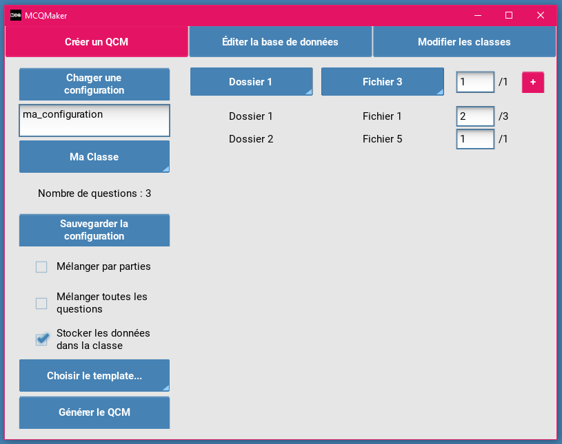
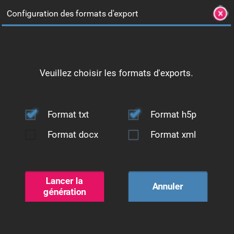

---
export_on_save:
    puppeteer: ["pdf"] # export PDF file on save
---
# MCQMaker

*Version 4.0.1*

## Installation

Pour installer le programme sur votre ordinateur deux options sont possibles :
- Si vous utilisez *Windows*, vous pouvez télécharger la version exécutable sous forme de fichier *zip* à [l'adresse suivante](#TODO). Une fois le téléchargement terminé, décompressez le fichier à l'endroit souhaité.
- Si vous utilisez un autre OS ou que vous souhaitez modifier votre version de MCQMaker vous pouvez cloner le dépôt git en utilisant la commande suivante dans un terminal une fois dans le dossier de votre choix.

```bash
git clone git@gitlab.com:PaulCreusy/qcmmaker.git
```

### Création d'un environnement virtuel

Si vous choisissez de cloner le dépôt, vous voudrez peut-être utiliser un environnement virtuel.

Vous pouvez le créer avec la commande :

```bash
python -m virtualenv mcqmaker_venv
```

Pour le démarrer, utilisez la commande suivant sous Windows : 

```bash
mcqmaker_venv\Scripts\Activate.ps1
```

Et pour MacOS et Linux :

```bash
mcqmaker_venv\Scripts\activate
```

### Installation des packages nécessaires

Pour utiliser ce logiciel vous devez installer plusieurs packages Python détaillés dans le fichier `requirements.txt`.

Pour les installer, utilisez la commande :

```
pip install -r requirements.txt
```

## Utilisation

Si vous avez téléchargé la version exécutable, il vous suffit de doubler-cliquer sur le fichier `MCQMaker.exe`.

Si vous avez cloné le dépôt git, le programme se lance avec la commande suivante dans le dossier du programme :
```bash
python MCQMaker.py
```

*MCQMaker* est composé de quatre menus principaux dont la fonction est expliquée ci-dessous :
- un menu général se lançant au démarrage de l'application
- un menu de génération de QCM
- un menu de création et d'édition de bases de données
- un menu de modification des classes


### Menu de génération de QCM

Ce menu permet de générer des QCM dans plusieurs formats différents, `txt`, `docx`, `h5p` et `xml`, à partir de configurations créées dans ce menu.



#### Création d'une configuration

Afin de créer une configuration, vous devez sélectionner un fichier de la base de données, à l'aide du menu du haut à droite. Après choisi le dossier et le fichier souhaité, vous avez la possibilité de rentrer le nombre de questions de ce fichier que vous souhaitez dans le QCM. Le nombre de questions disponibles dans le fichier est indiqué à droite de la zone de texte. Vous devez ensuite ajouter la base de données en cliquant sur le bouton `+`. Ce nouveau fichier sera donc affiché dans la liste défilante juste en dessous et vous aurez la possibilité par la suite de modifier le nombre de questions des fichiers déjà choisis.

!!! tip Nombre de questions
    Le nombre total de questions contenues dans la configuration est affiché sur le menu de gauche. 

Avant de la sauvegarder, vous devez spécifier son nom dans la zone de texte correspondante. Après l'avoir sauvegardée, vous pourrez la charger ultérieurement à l'aide du bouton `Charger une configuration`.

!!! info Sélection d'une classe
    Si vous choisissez d'utiliser une classe, il est possible que le nombre total de questions disponibles dans certains fichiers, qui auraient déjà été utilisés par cette classe dans une génération de QCM précédente, soit différent de la valeur contenue dans la configuration. En cas de dépassement du nombre de questions disponibles, le nombre de questions sélectionnées sera modifié automatiquement pour être égal au maximum.

#### Génération d'un QCM

La génération du QCM est lancée à partir du bouton `Générer le QCM` une fois qu'une configuration a été choisie ou entrée dans l'interface.

**Choix de la configuration**
Afin de choisir une configuration, cliquez sur le bouton `Charger une configuration` où vous aurez la possibilité d'en créer une nouvelle ou d'en charger une déjà existante. Le nom de la configuration sélectionnée sera celui utilisé comme nom du QCM.

!!! note Création d'une nouvelle configuration
    Il n'est pas du tout nécessaire de passer par ce bouton pour créer une nouvelle configuration. Vous pouvez tout simplement sélectionner des fichiers et entrer un nom de configuration.

**Choix de la classe**
Vous avez la possibilité de choisir une classe avant de procéder à la génération du QCM. Cela limitera les questions choisies lors de la génération du QCM en ne prenant pas celles qui ont déjà été utilisées par cette classe. De plus, si vous le souhaitez, les questions qui seront utilisées pour cette génération de QCM peuvent être sauvegardées dans la classe, afin qu'elles ne soient pas à nouveau utilisées dans un QCM suivant.

**Choix du template**
Afin de permettre la génération en `docx`, sélectionnez le template Word que vous souhaitez utiliser. Un template par défaut a été fourni dans le dossier `Templates`, mais vous pouvez le modifier, en particulier son style, tant que les conventions suivantes sont conservées :
- pour afficher le titre du QCM, si vous souhaitez le spécifier, la syntaxe `{NAME_MCQ}` doit être utilisée.
- pour afficher la liste des questions, les indicateurs `### LIST_QUESTIONS_START ###`, pour indiquer le début de cette liste, et `### LIST_QUESTIONS_END ###`, pour indiquer sa fin, doivent être présents.
- pour chaque question, les conventions suivantes sont utilisées :
  - `{ID_QUESTION}` pour afficher le numéro de la question
  - `{QUESTION}` pour afficher la question
  - `{LIST_OPTIONS}` pour afficher toutes les options en colonne

**Options supplémentaires**
Vous avez également la possibilité de personnaliser le QCM créé notamment à l'aide des trois cases à cocher :
- `Mélanger par parties` permet de mélanger les questions au sein d'un même fichier de la base de données.
- `Mélanger toutes les questions` permet de mélanger toutes les questions du QCM, que ce soit au sein d'un même fichier de la base de données ou entre ces fichiers.
- `Stocker les données dans la classe` permet d'enregistrer dans la classe sélectionnée les questions sélectionnées pour cette génération, ce qui permet d'éviter des doublons pour le prochain QCM.

**Génération du QCM**
En cliquant sur le bouton `Lancer la génération`, la fenêtre ci-dessous s'affiche dans laquelle vous pouvez choisir les formats d'export des QCM générés, parmi `txt`, `docx`, `h5p` et `xml`.



Le QCM généré, sous ses différents formats, est sauvegardé dans le dossier `Export` : un dossier contenant tous les formats souhaités aura alors été créé, ayant pour nom celui de la configuration joint à celui de la classe sélectionnée.

!!! info Export au format `docx`
    L'export au format `docx` n'est possible que si vous avez sélectionné un template dans la liste déroulante de choix correspondante.

### Menu d'édition de bases de données

Ce menu permet de créer de nouveaux fichiers dans la base de données et d'éditer les fichiers déjà existants.


**Création d'un dossier**
Vous pouvez créer un dossier dans la base de données à partir de ce menu, en sélectionnant sur la première liste déroulante de choix `Nouveau` ; vous pourrez ensuite rentrer le nom de ce nouveau dossier dans la zone de texte correspondante, puis cliquer sur le bouton de création.

**Création d'un fichier**
Vous pouvez créer un fichier dans un dossier de la base de données à partir de ce menu ; pour cela, vous pouvez sélectionner le nom du dossier souhaité, puis sélectionner `Nouveau`. Vous pouvez ensuite spécifier le nom de ce nouveau fichier, qui ne soit pas un nom déjà pris par un fichier de ce même dossier, puis le sauvegarder avant ou après avoir inséré quelques questions dans la base de données à partir du menu du bas. Cette fonctionnalité est détaillée juste ensuite.

**Édition d'un fichier**
Vous pouvez éditer un fichier, que ce soit un nouveau ou un précédemment sauvegardé à l'aide de la partie inférieure de l'écran. Chaque question est affichée dans cette partie, en étant affectée à un numéro, et les choix de réponses possibles sont affichés en dessous, chacun associé à une case à cocher signifiant qu'il s'agit de la bonne réponse. Vous pouvez ajouter une option en cliquant sur le bouton `+` situé à la fin de la liste d'options déjà existantes.
Vous pouvez également supprimer une question en cliquant sur le bouton `-` situé à la fin de chaque question. 
Vous pouvez finalement rajouter une question en cliquant sur le bouton `+` situé en bas de l'écran.

!!! info Numéro de la question
    Le numéro de la question est arbitraire, il vous sert simplement à vous repérer dans le fichier, notamment lors de la sauvegarde des questions si des erreurs sont détectées, mais il n'a aucune importance pour la génération du QCM.

!!! tip Suppression d'option
    Une option peut être supprimée en effaçant simplement son contenu dans la zone de texte ; la sauvegarde ne la prendra pas en compte.

!!! tip Navigation facile
    Pour faciliter l'édition de fichier dans ce menu, vous pouvez naviguer entre les zones de textes, cases à cocher et boutons en appuyant sur `TAB`. La zone sélectionnée sera affichée en rose afin de vous permettre de vous repérer. De plus, une fois sur une case à cocher ou sur un bouton, vous pourrez appuyer sur `ENTRÉE` afin de respectivement cocher ou décocher la case, ou déclencher la fonction liée au bouton.

!!! error Suppression de questions après la génération d'un QCM avec des classes
    Si vous utilisez des classes et que vous modifiez un fichier de la base de données qui a déjà servi à générer un QCM, notamment en supprimant des questions, les données dans votre classe ne seront plus correctes. Il est conseillé de ne pas effectuer ce genre de manœuvres ou bien de réinitialiser la classe avant de modifier le fichier de la base de données.

**Détection des erreurs**
Lors de la sauvegarde d'un fichier, plusieurs vérifications sont effectuées sur le contenu que vous aurez rentré :

- tout d'abord, une question où rien n'a été entré dans la zone de texte intitulée `Question` ne sera pas prise en compte, et donc non sauvegardée, même si des informations sont contenues dans les champs d'options.
- ensuite, un message d'erreur apparaîtra si aucune bonne réponse n'a été sélectionnée, interrompant la sauvegarde de la totalité de la base de données. L'utilisateur devra sélectionner une bonne réponse dans la question considérée puis sauvegarder à nouveau le fichier.
- finalement, une option vide ne sera pas considérée et donc non sauvegardée. S'il s'agissait de l'unique bonne réponse à la question, le même message d'erreur que précédemment sera affiché.

!!! warning Sauvegarde du fichier en cours d'édition
    Si vous changez de fichier ou de dossier sans avoir sauvegardé au préalable le fichier que vous étiez en train d'éditer, ses modifications seront perdues.

### Menu de modification des classes

Ce menu permet de gérer les classes qui seront utilisables dans le menu de génération de QCM. 


**Classes existantes**
La partie en haut à gauche du menu vous permet de sélectionner une classe déjà existante. Le contenu de la classe sélectionnée sera affiché dans la partie inférieure de la fenêtre. Pour chaque fichier de la base de données, le ratio du nombre de questions utilisées par rapport au nombre total de questions sera indiqué à côté. Vous pouvez réinitialiser les données de cette classe en cliquant sur le bouton dédié : cela signifie que toutes les questions de tous les fichiers de la base de données seront de nouveau accessibles à la classe.

!!! warning Réinitialisation des données
    Réinitiliser les données d'une classe est une action irréversible.

**Création de classe**
La partie de droite de ce menu permet de créer une nouvelle classe, après avoir spécifié son nom dans la zone de texte correspondante. Vous ne pourrez pas créer une classe ayant le même nom qu'une classe déjà existante.

## Première utilisation

Pour une première utilisation, il vous est tout d'abord conseillé de créer une base de données à partir du deuxième menu. Pour plus d'informations à ce propos, vous pouvez vous référer à [cette section](#menu-dédition-de-bases-de-données).

!!! warning Codes dans la base de données
    Il vous est fortement de lire la section sur les [codes de base de données](#codes-dans-la-base-de-données) avant de procéder à la création de votre première base.

Si vous souhaitez utiliser le principe de classes (qui permettent de mémoriser les questions déjà utilisées pour la génération d'un QCM afin d'éviter les redondances entre différents QCM), vous pouvez vous rendre dans le troisième menu. Vous pouvez y créer sa classe à l'aide de la partie droite du menu, comme expliqué dans [cette section](#menu-de-modification-des-classes).

Vous pouvez ensuite procéder à la génération du QCM en se rendant dans le premier menu, dont l'utilisation est expliquée dans [cette section](#menu-de-génération-de-qcm).

## Paramètres du logiciel

### Langue

Vous pouvez changer la langue du logiciel en vous rendant dans le dossier `data` puis dans le fichier `settings.json`. Les valeurs possibles pour la clé `language` sont :
- `french`
- `english`
- `german`

!!! note Prochaine version
    Dans une prochaine version, vous pourrez l'effectuer directement dans l'interface pour plus de facilité.

### Codes dans la base de données

Deux caractères spéciaux sont utilisés lors de la sauvegarde des bases de données et par conséquent vous ne pourrez pas les utiliser lorsque vous entrerez vos questions et vos réponses dans le menu d'édition de bases de données. Ces deux caractères spéciaux doivent être changés dans le fichier `settings.json` du dossier `data` dès la première utilisation, si ce sont des caractères que vous souhaitez utiliser (la base de données ne fonctionnera plus sinon). Il s'agit des deux paramètres `correct_answer_separator` et `question_answer_separator`. 

!!! tip Valeurs par défaut
    Les deux caractères spéciaux par défaut sont hérités d'une version antérieure du projet ; il s'agit des caractères `@` et `|` que vous ne pourrez donc pas saisir dans votre base de données lors de la rédaction des questions ou des options.

## Crédits

Ce logiciel a été développé par Paul Creusy, pour la partie *backend*, et Agathe Plu pour la partie *frontend*. 
Les auteurs remercient leurs familles pour leur avoir demandé ce projet et l'avoir testé. 

## Licence

Ce programme est sous licence `Apache License version 2.0`.
